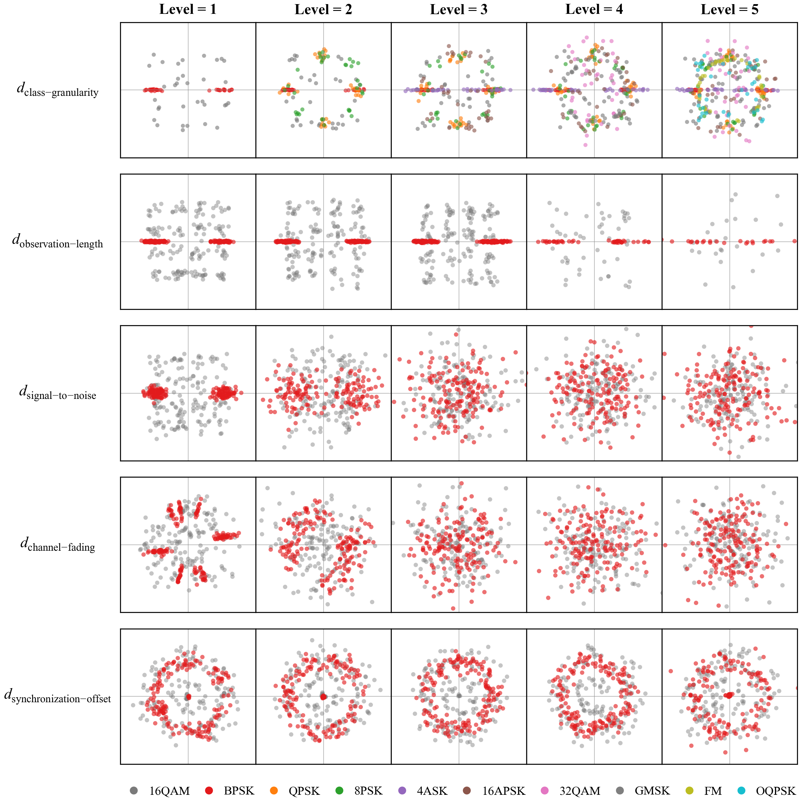

# DCS Signal Generator

**Demand-Capability Scaled Signal Generation for Automatic Modulation Classification**

The DCS signal generator (repository identifier: **DCS-SG**) is the signal-generation component of the Demand-Capability Scaled (DCS) Agent framework for automatic modulation classification (AMC). It converts demand-scale levels into controllable I/Q samples for capability probing under heterogeneous electromagnetic environments. The resulting probes expose scale-specific model strengths and failure modes that can be obscured by aggregate accuracy on a fixed benchmark.

Within the complete DCS Agent loop, the generator constructs scale-conditioned test sets; the agent evaluates candidate AMC algorithms, compares measured capability with the target demand profile, and uses unmet probes together with an AMC knowledge base to guide model revision and retesting.

This repository contains only the core generation and probe-planning logic. Generated HDF5 data, checkpoints, training logs, paper drafts, the agent implementation, and model-specific training code are intentionally excluded.

## Core Controls

The DCS signal generator currently implements five signal-environment scales:

| Axis | Meaning | Level effect |
| --- | --- | --- |
| `snr` | low-SNR robustness | higher level selects lower SNR ranges |
| `obs` | observation budget | higher level shortens the effective observation length |
| `chan` | fading-channel robustness | higher level increases multipath/Doppler/fading severity |
| `off` | synchronization-mismatch robustness | higher level increases frequency/phase/timing offsets |
| `gra` | fine-grained class discrimination | higher level increases the modulation class set |

The HDF5 output also stores inactive auxiliary demand fields for compatibility with the complete DCS framework.

### Five-Scale Level Visualization

The figure below shows representative DCS-generated I/Q constellations when one demand scale is varied from Level 1 to Level 5 while the remaining generation settings are held fixed. It visualizes the progressive effects of class granularity, observation length, SNR, channel fading, and synchronization offset on the received samples.

<p align="center">
  
</p>

## Layout

```text
DCS-SG/
  src/dcs_sg/
    config.py              # modulation classes, scale levels, class-granularity sets
    generator.py           # batched PyTorch IQ-signal synthesis and impairments
    storage.py             # HDF5 writer bucketed by observation length
  scripts/
    generate_dataset.py    # raw DCS signal generation entry
    plan_boundary_cases.py # boundary/stress case planner for profile-based runs
  examples/
    *.csv, *.txt           # lightweight generated plans/commands
  model_sources/
    tr_amr/                # agent-reproduced Tr-AMR and its DCS Agent revision
    mcnet/                 # agent-reproduced MCNet and MCNetEnhanced
    iqformer/              # IQFormer backbone and DCS Agent adapter variants
    expert_assistant/      # PyTorch E-A backbone and its DCS Agent revision
```

## Installation

```powershell
cd <path-to-your-DCS-SG-repository>
pip install -e .
```

Use CUDA for full-scale data generation. CPU mode is useful for smoke tests.

## Smoke Test

```powershell
cd <path-to-your-DCS-SG-repository>
python scripts\generate_dataset.py --snr 0 --output-dir generated_data\smoke --reps 4 --obs-levels 1 --chan-levels 2 --off-levels 1 --granularity-level 1 --batch-size 128 --device cpu --seed 20260426
```

The output is an HDF5 file such as `generated_data/smoke/amc_snr_+00dB.h5` with groups:

```text
data/obs_0/X, data/obs_0/Y, data/obs_0/SNR, data/obs_0/demand
data/obs_1/X, data/obs_1/Y, data/obs_1/SNR, data/obs_1/demand
...
```

`X` has shape `(N, 2, L)`, where the second dimension stores I and Q channels.

## Boundary and Stress Plans

Generate the case table and commands for a model profile:

```powershell
python scripts\plan_boundary_cases.py --profile mcnet --stage all --reps 512
```

Run the raw HDF5 generation for the selected cases:

```powershell
python scripts\plan_boundary_cases.py --profile mcnet --stage boundary --reps 512 --run --output-root generated_data
```

Built-in example profiles:

| Profile | Source-like SNR range | Base obs | Model pack length |
| --- | --- | --- | --- |
| `tramr` | 0 to 30 dB | 1 | 1024 |
| `mcnet` | -20 to 30 dB | 1 | 1024 |
| `iqformer` | -20 to 18 dB | 4 | 128 |
| `ea` | -20 to 30 dB | 1 | 1024 |

The profile only controls case planning and records a reference model packing length. The DCS signal generator outputs bucketed raw observations by `obs_level`; each model project can then pack, crop, pad, train, and evaluate the raw HDF5 files using its own input format.

## Reproducibility Notes

- `--source-mode natural` is the default and follows the RadioML-style idea of text-like digital bit streams and audio-like analog messages.
- `--seed` controls deterministic sample identity. Changing `--batch-size` does not change generated samples in deterministic mode.
- For negative SNR lists, prefer the equals form, for example `--snrs=-20,-18,-16`.
- Full experiment generation with `reps=512` can create large HDF5 files. Keep `generated_data/` outside commits or rely on `.gitignore`.

## Using the DCS Signal Generator with the DCS Agent

A typical model-specific experiment can use the case rules collected here as follows:

1. build single-axis boundary cases for `snr`, `obs`, `chan`, `off`, and `gra`;
2. optionally build bivariate high-level stress cases and an all-axis stress case;
3. call the DCS signal generator to generate raw HDF5 files;
4. pack the raw files into the model's input length and label convention;
5. train and evaluate the target model;
6. return scale-wise performance gaps to the DCS Agent for knowledge-constrained model revision and retesting.

The generation pipeline preserves steps 1-3. The architecture snapshots under `model_sources/` document the models used in steps 4-6, but their dataset packing, checkpoint loading, training, and evaluation entry points remain model-specific.

## Model Source Snapshots

`model_sources/` contains the model definitions used in the four-model study. Here, **reproduced backbone** denotes the implementation reconstructed by the agent from the corresponding paper and source repository; **DCS Agent revision** denotes the model obtained after feeding DCS probe failures back to knowledge-constrained code optimization. These files are source snapshots for inspection and reproduction and do not alter or depend on the DCS signal-generation path.

| Model | Reproduced backbone | DCS Agent revision used in the study | Source files |
| --- | --- | --- | --- |
| Tr-AMR | `VisionTransformer` / `vit_` | `EnhancedTrAMRV3`: zero-start local token, post-encoder, and attentive-pooling adapters | `model_sources/tr_amr/vit_model_2018.py`, `enhanced_tr_amr.py` |
| MCNet | `MCNet` | `MCNetEnhanced`: observation-aware pooling with residual channel and temporal gates | `model_sources/mcnet/mcnet_model.py` |
| IQFormer | `IQFormer` | `IQFormerChannelAdapter`: zero-start I/Q FIR, STFT, token, and classifier-head adapters | `model_sources/iqformer/model/IQFormer.py`, `IQFormer_channel_adapter.py` |
| E-A | `ExpertAssistant` | `ExpertAssistantEnhanced`: phase/frequency compensation with spectral and feature residual branches | `model_sources/expert_assistant/model/expert_assistant_torch.py`, `expert_assistant_enhanced_torch.py` |

The IQFormer snapshot additionally retains `IQFormer_enhanced.py`, `IQFormer_adapter.py`, and `utils/stft_features.py`, which were used to compare front-end/fusion and residual-adapter alternatives during development. The channel-adapter implementation listed in the table is the primary improved variant used for the reported DCS boundary and stress results.

The Tr-AMR, MCNet, and E-A snapshots require PyTorch. IQFormer additionally imports `einops` and `timm`. Install these optional dependencies with `pip install -r model_sources/requirements.txt`. They are deliberately kept separate from the core DCS-SG requirements because raw signal generation does not use the classifier implementations. Checkpoints, generated datasets, and model-specific training wrappers are not included.

## AMC Knowledge Base Used by the DCS Agent

The DCS Agent knowledge base uses **25 papers** selected from the accompanying literature catalogue. They cover efficient convolutional and recurrent architectures, Transformers, graph neural networks, multi-representation fusion, data augmentation, denoising, domain adaptation, and few-shot learning for AMC. During feedback optimization, their structured records provide evidence for mapping an unmet demand scale to candidate source-code revisions. Every title and publisher link below is traceable to the catalogue.

1. [Knowledge Distillation for Modulation Classification in Resource-Constrained Devices](https://ieeexplore.ieee.org/document/11174704)
2. [Self-Supervised Aligned Data Augmentation Network for Imbalanced Modulation Classification](https://ieeexplore.ieee.org/document/11007136)
3. [AMCRN: Few-Shot Learning for Automatic Modulation Classification](https://ieeexplore.ieee.org/document/9650842)
4. [An Efficient and Lightweight Model for Automatic Modulation Classification: A Hybrid Feature Extraction Network Combined with Attention Mechanism](https://www.mdpi.com/2079-9292/12/17/3661)
5. [Automatic Modulation Classification for Adaptive OFDM Systems Using Convolutional Neural Networks With Residual Learning](https://ieeexplore.ieee.org/document/10154062)
6. [A Wiener Filter Denoising Based Intelligent Modulation Recognition System](https://ieeexplore.ieee.org/document/9880789)
7. [Automatic Modulation Classification Based on Hierarchical Recurrent Neural Networks With Grouped Auxiliary Memory](https://ieeexplore.ieee.org/document/9265251)
8. [Automatic Modulation Classification Using CNN-LSTM Based Dual-Stream Structure](https://ieeexplore.ieee.org/document/9220797)
9. [ConvLSTMAE: A Spatiotemporal Parallel Autoencoders for Automatic Modulation Classification](https://ieeexplore.ieee.org/document/9789162)
10. [IRLNet: A Short-Time and Robust Architecture for Automatic Modulation Recognition](https://ieeexplore.ieee.org/document/9583289)
11. [MCNet: An Efficient CNN Architecture for Robust Automatic Modulation Classification](https://ieeexplore.ieee.org/document/8963964)
12. [GIGNet: A Graph-in-Graph Neural Network for Automatic Modulation Recognition](https://ieeexplore.ieee.org/document/10896841)
13. [DTSG-Net: Dynamic Time Series Graph Neural Network and Its Application in Modulation Recognition](https://ieeexplore.ieee.org/document/10787244)
14. [AvgNet: Adaptive Visibility Graph Neural Network and Its Application in Modulation Classification](https://ieeexplore.ieee.org/document/9695244)
15. [A Modulation Classification Algorithm Based on Feature-Embedding Graph Convolutional Network](https://ieeexplore.ieee.org/document/10493016)
16. [An Effective Masked Transformer Model for Automatic Modulation Recognition](https://ieeexplore.ieee.org/document/10934715)
17. [Fine-Grained Modulation Classification Using Multi-Scale Radio Transformer With Dual-Channel Representation](https://ieeexplore.ieee.org/document/9690153)
18. [Signal Modulation Classification Based on the Transformer Network](https://ieeexplore.ieee.org/document/9779340)
19. [Abandon Locality: Frame-Wise Embedding Aided Transformer for Automatic Modulation Recognition](https://ieeexplore.ieee.org/document/9915584)
20. [IQFormer: A Novel Transformer-Based Model With Multi-Modality Fusion for Automatic Modulation Recognition](https://ieeexplore.ieee.org/document/10729886)
21. [A Transformer-Based Contrastive Semi-Supervised Learning Framework for Automatic Modulation Recognition](https://ieeexplore.ieee.org/document/10093837)
22. [Automatic Modulation Recognition Based on Deep-Learning Features Fusion of Signal and Constellation Diagram](https://www.mdpi.com/2079-9292/12/3/552)
23. [Cross-Domain Automatic Modulation Classification: A Multimodal-Information-Based Progressive Unsupervised Domain Adaptation Network](https://ieeexplore.ieee.org/document/10738272)
24. [Modulation Classifier: A Few-Shot Learning Semi-Supervised Method Based on Multimodal Information and Domain Adversarial Network](https://ieeexplore.ieee.org/document/9966586)
25. [CFCS: A Robust and Efficient Collaboration Framework for Automatic Modulation Recognition](https://ieeexplore.ieee.org/document/10272355)
