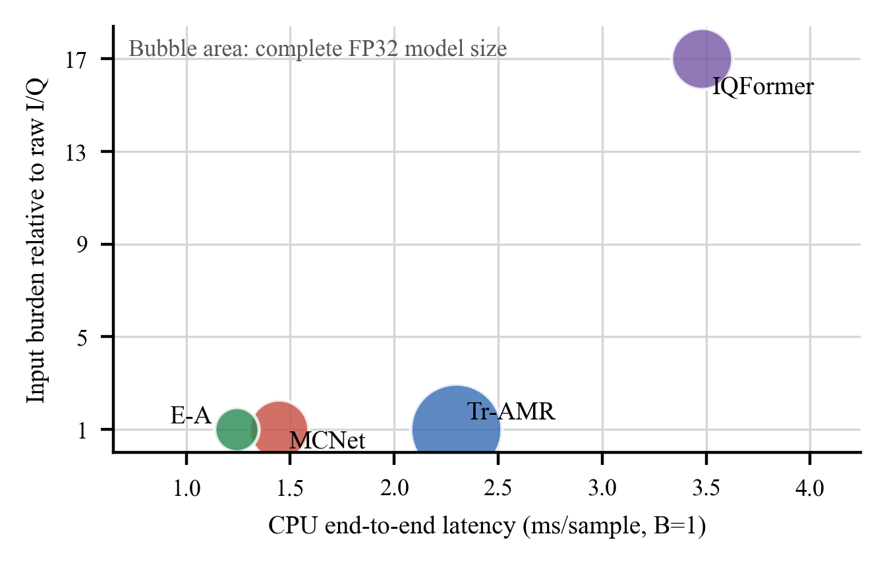

# SPL Supplementary Experiment Results

This directory publishes the compact result tables and figures that accompanied the SPL submission. It covers four reproduced AMC backbones, denoted **Original**, and the corresponding DCS Agent revisions, denoted **+Ours**.

The accuracy values are measured results, not fitted or manually adjusted curves. CSV accuracies are stored as fractions in `[0, 1]` and are converted to percentages only for plotting.

## Evaluation Protocol and Scope

For each DCS case, deterministically generated samples were split once into disjoint 70% training and 30% evaluation subsets. Evaluation samples were excluded from gradient updates, and Original and +Ours used identical indices for paired comparison. The same evaluation subset was also used for checkpoint selection, so these values are held-out development measurements rather than independently seeded confirmation-test estimates.

This package reproduces figures from the committed aggregate measurements. It does not provide full model retraining: generated HDF5 files, checkpoints, training logs, and model-specific training wrappers remain outside this repository.

## Included Results

### Single-scale demand levels

`data/boundary_dimension_level_detail.csv` contains Levels 0-5 for SNR, observation length, channel fading, synchronization offset, and class granularity. Level 0 is a calibration condition; the supplementary figure uses Levels 1-5, yielding 100 plotted Original/+Ours point pairs across four models and five scales.


### Ten bivariate Level-5 probes and All-5

`data/stress_case_detail.csv` contains the actual accuracy for all ten pairs of the five signal scales with both focal scales set to Level 5, plus the setting in which all five scales are Level 5. The CSV records the remaining scale settings and SNR lists used for every model and case.


The optimized mean over the ten bivariate probes is 51.95% for Tr-AMR, 57.51% for MCNet, 70.02% for IQFormer, and 57.10% for E-A. Their optimized All-5 accuracies are 20.08%, 19.27%, 30.41%, and 19.50%, respectively.

### Deployment profile of +Ours



Bubble area represents complete FP32 model size, calculated as `parameter_count * 4 / 1024^2` MiB. CPU latency is per sample at batch size 1 with eight CPU threads. IQFormer end-to-end latency includes 0.0848 ms/sample for external SciPy STFT construction, and its raw-plus-STFT input contains 17 times as many scalar values as its raw I/Q input. The recorded run used PyTorch 2.9.1 and an NVIDIA GeForce RTX 4090 for the GPU columns. The CPU model was not recorded, so the latency values should be treated as run-specific measurements rather than hardware-independent constants.

`data/four_experiment_delta_summary.csv` is also included for auditing aggregate source-dataset, boundary, Level-5, bivariate, and All-5 results. Its `boundary_mean_acc` fields average Levels 0-5, including the calibration level; `boundary_l5_mean_acc` averages only the five Level-5 single-scale cases.

## Reproduce and Validate

From the repository root:

```powershell
python -m pip install -r paper_results\spl_supplementary\requirements.txt
python paper_results\spl_supplementary\validate_results.py --check-paper-hashes
python paper_results\spl_supplementary\plot_supplementary_results.py
```

The validator reconstructs each published CSV from the lower-level aggregate inputs, verifies case counts and accuracy deltas, checks the aggregate means, and optionally checks deterministic CSV, JSON, and PNG SHA-256 values against the audited SPL artifacts. PDF hashes are excluded because Matplotlib embeds a creation timestamp; figure hashes can also differ after regeneration with another Matplotlib or font version even when all plotted coordinates are unchanged.

## Ablation Audit

No component-level architecture ablation is included in this snapshot. The available exploratory Tr-AMR All-5 runs were incomplete or used different training settings, and the available IQFormer adapter comparisons used different optimization budgets. They do not isolate one component under a controlled protocol and are therefore not presented as ablation evidence.
